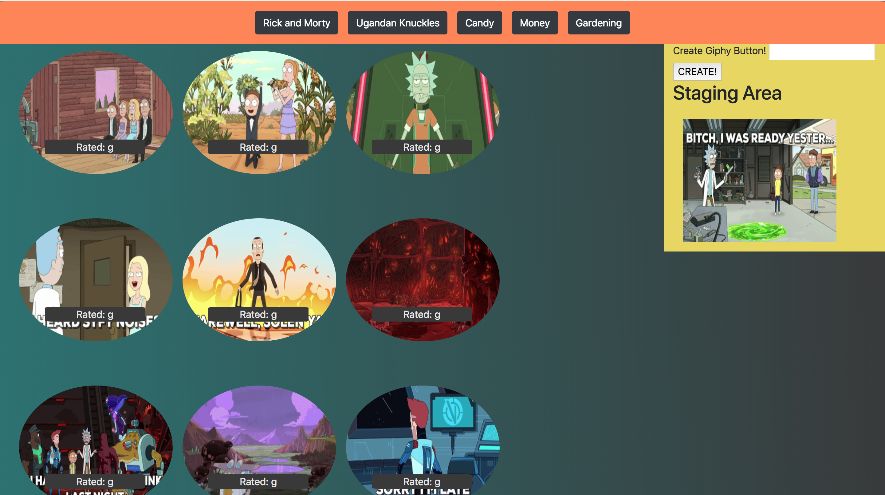

# Fun With Giphys

Screwing around with Giphy API. You can click the existing buttons to add 10 giphys per ajax call
to the Giphy API. You can also dynamically add buttons by using the form on the right column
-those new buttons can then add your preferred giphys.

## Getting Started

Hosted on [GitHub pages](https://unobtainiumrock.github.io/giphy-api-fun/).

## Built With

* [Bootstrap](https://getbootstrap.com/docs/4.0/getting-started/introduction/)
* [JQuery](http://jquery.com/)
* [Javascript](https://eloquentjavascript.net/)
* [CSS](https://css-tricks.com/)
* [HTML](https://developer.mozilla.org/en-US/docs/Web/HTML)
* [GIPHY API](https://developers.giphy.com/docs/) 

## Authors

* **Unobtainiumrock**

## License

This project is licensed under the MIT License - see the [LICENSE.md](LICENSE.md) file for details

## Acknowledgments

* Pineapple goes well on pizza
* Cats
* Trees
* Unobtainiumrock Industries ®

